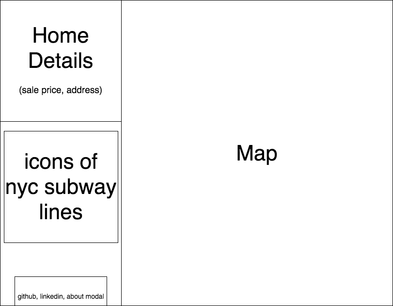

# Gentrifi

### Background

Gentrifi is a data-visualization infographic that aims to plot recent home sales price data by NYC subway lines. This infographic attempts to illustrate the correlation between real estate prices and proximity to subway lines.

1) Recent home sales will be plotted in Google Map API along with an overlay of the NYC subway line.
2) Recent home sales price data in NYC is obtained from public databases from http://www1.nyc.gov/site/finance/taxes/property-rolling-sales-data.page.
3) User can filter through subway lines and view sales transactions near that line.

### Functionality & MVP  

User will be able to:

- [ ] Click on a subway line on Google Map
- [ ] Mouseover recent home sale markers that will display more details about the transaction

In addition, this project will include:

- [ ] A production README

### Wireframes

This infographic will consist of a single screen with a map, and nav links to the Github, my LinkedIn,
and the About modal. Clickable subway lines will be used to toggle between the subway lines.

### Architecture and Technologies

This project will be implemented with the following technologies:

- `JavaScript` for programming logic,
- `Google Map API`,
- `Browserify` to bundle js files.???

In addition to the entry file, there will be three scripts involved in this project:

`map.js`: this script will handle the logic for creating and rendering the map.

`marker.js`: this script will be responsible for handling the logic of real estate markers on the map.

`data.js`: .

### Implementation Timeline

**Day 1**: Setup all necessary Node modules, including getting webpack up and running and setting up the map in `map.js`. Write a basic entry file and the bare bones of all 3 scripts outlined above. Learn the how to generate the NYC subway on the map. Goals for the day:

- Get a green bundle with `Browserify`.
- Learn enough to render the NYC subway map onto the map.

**Day 2**: Dedicate this day to further expand knowledge about the Google Maps API. Think about how to generate real estate markers when filtering by subway line, how to connect them, etc. Then, change the style of the map.

- Make each subway line in the map clickable, toggling the state of the map on click.
- Generate markers close to proximity of the subway line when toggling state.

**Day 3**: Figure out how to compile the data onto Google Maps. Clean the data and do only homes. Goals for the day:

- Generate markers close to proximity of the subway line when toggling state.
- Import real estate database and populate real markers on the map.

**Day 4**: Polish and style the app.
